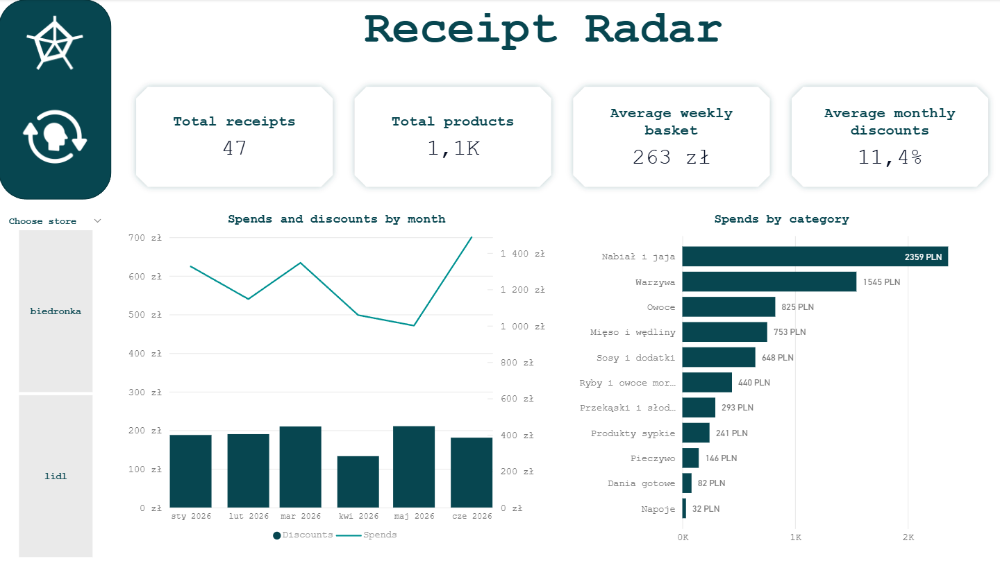
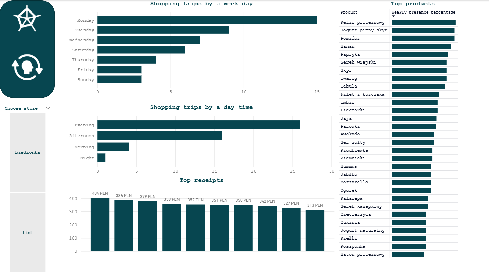

# ReceiptRadar - Business Summary

## 📌 Project Overview

ReceiptRadar is a personal analytics project built from a collection of supermarket receipts gathered by me. It converts these receipts into structured spend and product insights, with the final goal of powering a dashboard that shows where money was spent, which products were bought most often, and how shopping behavior changed over time.

This project is both a technical ETL pipeline and a personal data product: I collected receipts from multiple stores, built custom parsers, and normalized different data sources to create a reliable warehouse.

## 🎯 Analytical Goal

**Main Question:**
How can personal supermarket receipt data be transformed into a dependable analytics foundation for spend, category, and product insights?

## 🗄️ Data Source & Architecture

**Sources:**
- `data/raw/biedronka/json/` - Biedronka receipt exports in JSON format
- `data/raw/lidl/` - Lidl receipt exports in plain text
- `data/mappings/products.csv` - curated product mapping file used to normalize raw product names

**Architecture:**
- Raw receipts are collected and parsed from multiple data sources
- Parsed receipts load into a bronze layer in DuckDB
- A product mapping dimension is used to normalize and enrich items
- Silver and gold SQL views create the analytics model for dashboard reporting
- A single Python entrypoint runs the end-to-end pipeline

## 🧱 Data Model

The model follows a layered analytics architecture:

### Bronze layer
- `bronze_receipts` - receipt-level metadata (`receipt_id`, `date`, `store`)
- `bronze_receipts_items` - item-level details (`raw_name`, `quantity`, `unit_price`, `total_price`, `discount`, `final_price`)

### Dimension layer
- `dim_products` - normalized product mapping with stable `product_id`, `clean_name`, `category`, and `subcategory`

### Silver / Gold analytics layer
- `sql/silver/` - intermediate item-level view(s)
- `sql/gold/` - analytics views for spending, product frequency, discounts, and shopping patterns

## 📊 Analytics & Insights

ReceiptRadar delivers the inputs needed for a final dashboard that answers personal shopping questions and tracks spend over time.

The project enables insights such as:

- spending trends by week and month
- category spend distribution and top products
- Biedronka vs Lidl comparisons
- product frequency and purchase concentration
- unmapped product volume for data quality attention
- discount behavior and pricing impacts
- shopping timing trends by weekday and time of day

## 📸 Dashboard Preview

The final dashboard is the central outcome of this project. It is intended to visualize the outputs of the gold layer and make the analytics accessible.

## 🎥 Dashboard Demo

**What’s shown:**
- Navigation between report pages
- Interactive filtering with slicers

## 🛠️ Tech Stack

- **Power BI** - final dashboard, simple modeling, DAX
- **Python** - ETL pipeline orchestration
- **DuckDB** - local warehouse and analytics engine
- **Pandas** - raw receipt transformation and mapping enrichment
- **SQL** - silver/gold view definitions for business reporting

## 🧠 What I Learned

- Collecting and parsing personal receipt data from multiple stores
- Normalizing raw product descriptions into a single mapping-driven warehouse
- Building a layered analytics model that supports a final dashboard
- Making data quality visible through unmapped product detection
- Translating personal transaction history into business-ready spend metrics
